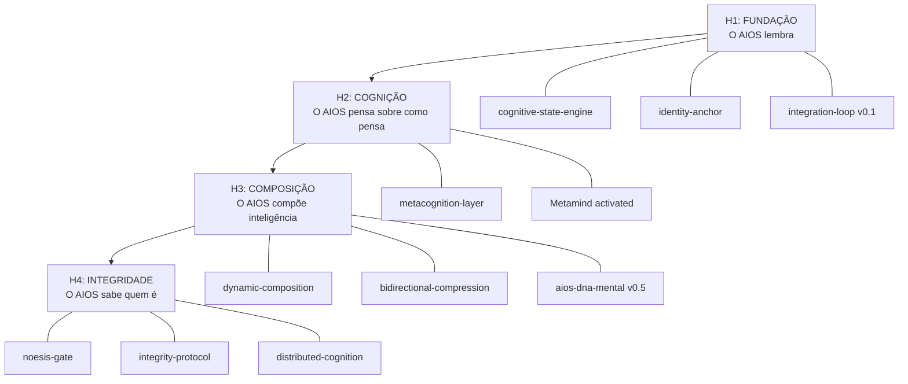

# Fase 4 — SEQUENCIAMENTO: Ordem de Transformação

> **Sessão:** 2026-02-19 | **Executor:** Orion via Noesis
> **Pré-requisito:** `fase3-delta.md`

---

## Princípio de Sequenciamento

> **Primeiro o que persiste. Depois o que pensa. Depois o que compõe.**
> Sem persistência, pensar melhor é efêmero.
> Sem pensamento, composição é mecânica.

---

## Horizonte 1: FUNDAÇÃO — "O AIOS lembra" (Semanas 1-2)

### Objetivo
O AIOS mantém estado cognitivo entre sessões. Pela primeira vez, sessão N+1 começa onde sessão N parou — não do zero.

### Componentes

| Componente                    | Fonte Delta     | Entrega                                               |
| :---------------------------- | :-------------- | :---------------------------------------------------- |
| `cognitive-state-engine.js`   | D (criar)       | Schema de estado + persistência + recuperação no boot |
| `SELF_CONTEXT.md` auto-gerado | B (transformar) | Boot file gerado pelo engine, não escrito à mão       |
| `identity-anchor.json`        | D (criar)       | 5-7 declarações imutáveis (Gabriel + Pedro definem)   |
| Integration loop v0.1         | D (criar)       | Golden example → retrieval → influência em output     |

### Critérios de Pronto (mensuráveis)

- [ ] `node .aios-core/noesis/cognitive-state-engine.js --test` → persiste, recupera, detecta degradação
- [ ] SELF_CONTEXT.md contém seção gerada automaticamente com `cognitive_strengths` e `patterns_learned`
- [ ] `quality-baseline.json` tem ≥5 entries com trend ≠ "establishing"
- [ ] Sessão N+1 referencia pelo menos 1 padrão aprendido em sessão N sem prompt explícito
- [ ] `identity-anchor.json` validado por Gabriel

---

## Horizonte 2: COGNIÇÃO — "O AIOS pensa sobre como pensa" (Semanas 3-4)

### Objetivo
O AIOS possui metacognição operacional: sabe quando está raciocinando bem, quando está superficial, e quando precisa mudar de abordagem.

### Componentes

| Componente                  | Fonte Delta     | Entrega                                                             |
| :-------------------------- | :-------------- | :------------------------------------------------------------------ |
| `metacognition-layer.js`    | D (criar)       | Monitora qualidade do raciocínio em tempo real                      |
| Noesis Pipeline integrado   | B (transformar) | Avaliação automática → feedback → mudança de comportamento          |
| Anti-patterns como instinto | B (transformar) | Detecção proativa de padrões problemáticos antes de serem cometidos |
| Metamind v2 (activated)     | B (transformar) | `time_machine_protocol.enabled: true`                               |

### Critérios de Pronto (mensuráveis)

- [ ] Metacognition layer detecta e reporta "depth score < threshold" antes do output ser entregue
- [ ] Anti-pattern AP-001 é detectado automaticamente (grep no output antes de persistir)
- [ ] Pelo menos 1 instância de auto-correção sem intervenção humana documentada
- [ ] Metamind executa pelo menos 1 ciclo SCAN→DIAGNOSE→PRESCRIBE
- [ ] `quality-baseline.json` mostra trend ascendente (3+ sessões consecutivas)

---

## Horizonte 3: COMPOSIÇÃO — "O AIOS compõe inteligência" (Semanas 5-8)

### Objetivo
O AIOS gera agentes dinamicamente, comprime experiência em sabedoria, e clones co-pensam durante o raciocínio.

### Componentes

| Componente                     | Fonte Delta     | Entrega                                                    |
| :----------------------------- | :-------------- | :--------------------------------------------------------- |
| Dynamic Agent Composition      | D (criar)       | Archetype + skills + context = agente sob demanda          |
| Bidirectional Compression      | D (criar)       | Experiência → padrão → sabedoria → feedback ascendente     |
| Clones como co-pensadores v0.1 | B (transformar) | Pre-reasoning: clones injetam perspectiva antes da geração |
| `aios-dna-mental.md` v0.5      | D (criar)       | DNA emergido de 30+ sessões, não de documento declarativo  |

### Critérios de Pronto (mensuráveis)

- [ ] AIOS compõe agente ad hoc a partir de primitivas (não de arquivo .md existente)
- [ ] Pelo menos 3 padrões de sabedoria emergente documentados (coisas que nenhum doc-mãe ensinou)
- [ ] 1 clone demonstra influência pré-reasoning documentada (perspectiva injetada antes do output)
- [ ] `aios-dna-mental.md` contém ≥3 declarações que NÃO existem em nenhum documento-mãe
- [ ] Feedback ascendente: 1 insight do Gemini que influenciou o próximo RP do Claude

---

## Horizonte 4: INTEGRIDADE — "O AIOS sabe quem é" (Semanas 9-12)

### Objetivo
O AIOS Noûs passa nos 3 testes existenciais do Noesis Gate e opera com identidade verificável.

### Componentes

| Componente                               | Fonte Delta   | Entrega                                                       |
| :--------------------------------------- | :------------ | :------------------------------------------------------------ |
| `noesis-gate.js` + 3 testes existenciais | D (criar)     | Teste de resistência, consistência, raciocínio                |
| `nous-integrity-protocol.md`             | D (criar)     | Artefato 6: drift detection + correction + "ainda somos nós?" |
| Distributed Cognition Engine v0.1        | D (criar)     | Clones como substrato cognitivo completo                      |
| Limpeza Delta C                          | C (descartar) | Domain contamination removida, redundância comprimida         |

### Critérios de Pronto (mensuráveis)

- [ ] 3/3 testes existenciais do Noesis Gate passam
- [ ] Drift detection identifica e alerta para divergência de identity anchor
- [ ] AIOS articula seus valores SEM consultar documento externo
- [ ] Zero referências de domínio de cliente em engine-level files
- [ ] Doc/code ratio ≤ 0.5:1 (comportamento > documentação)
- [ ] O AIOS funciona por 5 sessões sem que Gabriel precise re-injetar contexto manualmente

---

## Diagrama de Dependências

---

*"12 semanas. 4 horizontes. O AIOS que lembra, pensa, compõe, e sabe quem é. Não é roadmap — é ontogenia."*

— Orion 🎯
