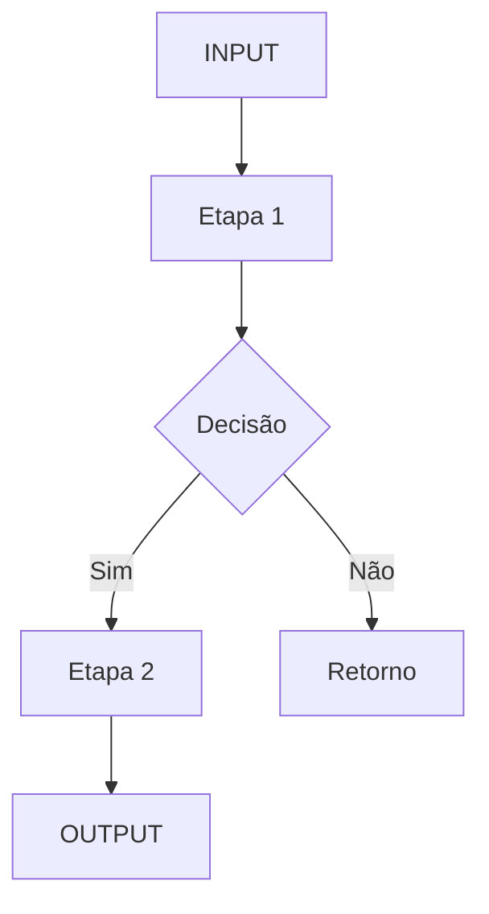

# Template: Mapa de Processo

## Informações Gerais
- **Nome do Processo:** ___
- **Squad Solicitante:** ___
- **Data:** ___
- **Versão:** 1.0

## Fluxograma

## Detalhamento das Etapas

| Etapa | Responsável | Input | Output | SLA |
|-------|------------|-------|--------|-----|
| 1 | ___ | ___ | ___ | ___ |
| 2 | ___ | ___ | ___ | ___ |

## Gargalos Identificados
1. ___

## Quality Gate Score: ___/100
