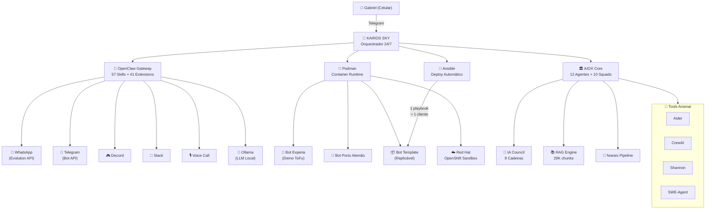

# 🐙 KAIROS HYDRA — Roadmap de Integração Total

> **Versão:** 1.0 · **Data:** 2026-03-21
> **Objetivo:** Unificar Red Hat, OpenClaw, KAIROS SKY, Bots e Tools em uma arquitetura Polvo com tentáculos autônomos.

---

## Arquitetura Final (Visão)



---

## Sprint 1 — Fundação (Hoje → Domingo 23/03)

> **Tema:** "O Polvo abre os olhos"

### 1.1 Reboot + WSL Ativo
- [ ] Reiniciar PC (WSL já instalado)
- [ ] Confirmar `wsl --status` funcional
- [ ] Instalar Ubuntu no WSL: `wsl --install -d Ubuntu`

### 1.2 Podman Desktop Operacional
- [ ] Gabriel instala Podman Desktop (download manual)
- [ ] Verificar: `podman --version`
- [ ] Testar: `podman run hello-world`

### 1.3 KAIROS SKY Local
- [ ] Rodar `python main.py` no venv do orchestrator
- [ ] Validar comandos `/brief`, `/status`, `/quests` no Telegram do celular
- [ ] Confirmar que o scheduler está rodando (7 tarefas)

### 1.4 OpenClaw Build (via WSL)
- [ ] No WSL: `nvm install 22.16 && nvm use 22.16`
- [ ] `cd /mnt/c/Users/GABS/Documents/My\ KAIROS/tools/integrations/openclaw`
- [ ] `pnpm install && pnpm build`
- [ ] Testar: `node openclaw.mjs --help`

**Entregável:** Sistema rodando local com Telegram, Podman e OpenClaw funcionais.

---

## Sprint 2 — Tentáculos de Comunicação (Seg-Ter 24-25/03)

> **Tema:** "O Polvo estende seus braços"

### 2.1 Bot Experia WhatsApp (Top of Funnel)
- [ ] Editar `clients/experia/bot-whatsapp/src/config/business.json`
- [ ] Configurar persona da Experia no `prompts/attendant.js`
- [ ] Fluxo de onboarding:
  ```
  Cliente chega → IA se apresenta → Faz 3 perguntas de qualificação →
  Mostra cases → Agenda reunião → Notifica Gabriel via Telegram
  ```
- [ ] Deploy no Podman: `podman build -t experia-bot . && podman run -d experia-bot`
- [ ] Conectar Evolution API → webhook do container

### 2.2 OpenClaw como Hub Multi-Canal
- [ ] Configurar extensão `whatsapp` apontando para Evolution API
- [ ] Configurar extensão `telegram` como mirror do SKY
- [ ] Testar roteamento: mensagem WA → OpenClaw → resposta via LLM
- [ ] Mapear `skill-creator` para criar skills customizados sob demanda

### 2.3 Ollama (LLM Local Zero-Cost)
- [ ] Instalar Ollama via WSL ou Windows
- [ ] Baixar modelo: `ollama pull llama3.1:8b`
- [ ] Conectar extensão `ollama` do OpenClaw
- [ ] Testar: bots usando LLM local (zero custo de API)

**Entregável:** Bot Experia funcionando no WhatsApp como demo de vendas + LLM local rodando.

---

## Sprint 3 — Infraestrutura Enterprise (Qua-Qui 26-27/03)

> **Tema:** "O Polvo conquista a nuvem"

### 3.1 Red Hat Developer Sandbox
- [ ] Ativar em: `developers.redhat.com/developer-sandbox`
- [ ] Instalar CLI: `oc` (OpenShift CLI)
- [ ] Login: `oc login --token=... --server=...`
- [ ] Testar deploy: `oc new-app python~https://github.com/Experiasolutions/kairos-orchestrator`

### 3.2 Containerizar Todo o Stack
- [ ] `Dockerfile` para KAIROS SKY (já existe no orchestrator)
- [ ] `Dockerfile` para Bot Template (criar)
- [ ] `Dockerfile` para OpenClaw Gateway (já existe)
- [ ] `podman-compose.yml` unificando os 3 serviços

### 3.3 Deploy no OpenShift
- [ ] Push containers para registry do OpenShift
- [ ] Deploy KAIROS SKY: `oc apply -f kairos-sky-deployment.yaml`
- [ ] Deploy Bot Experia: `oc apply -f experia-bot-deployment.yaml`
- [ ] Configurar routes (URLs públicas) para webhooks
- [ ] Testar: WhatsApp webhook → OpenShift → Bot → Resposta

**Entregável:** KAIROS SKY + Bot Experia rodando na cloud Red Hat 24/7 (grátis por 30 dias).

---

## Sprint 4 — Automação e Escala (Sex-Dom 28-30/03)

> **Tema:** "O Polvo se multiplica"

### 4.1 Ansible Playbook para Clientes
- [ ] Criar `infrastructure/ansible/new-client.yml`
  ```yaml
  # Input: nome do cliente, tipo de negócio, telefone WA
  # Output: bot deployado + webhook configurado + notificação no Telegram
  ```
- [ ] Testar: `ansible-playbook new-client.yml -e "client=hortifruti"`
- [ ] Documentar: 1 playbook = 1 novo cliente em 15 minutos

### 4.2 Conectar N8N ao Polvo
- [ ] Webhook receiver do SKY → N8N workflows
- [ ] Fluxo: Lead qualificado pelo bot → N8N → CRM (ClickUp) → Notificação Telegram
- [ ] Fluxo: Agendamento confirmado → N8N → Google Calendar → Lembrete

### 4.3 Dashboard Unificado
- [ ] `node scripts/dashboard.js` como painel central (localhost:3000)
- [ ] Adicionar métricas dos bots (mensagens/dia, leads, conversões)
- [ ] Deploy do dashboard no OpenShift

**Entregável:** Pipeline completo: Novo cliente → Playbook → Bot deployado → Leads → CRM.

---

## Sprint 5 — Inteligência e Autonomia (Semana 31/03-06/04)

> **Tema:** "O Polvo aprende sozinho"

### 5.1 Learning Model em Produção
- [ ] Ativar predições ativas no SKY
- [ ] Conectar `register_evidence()` aos bots (feedback loop)
- [ ] Dashboard de accuracy do modelo

### 5.2 Night Shift Autônomo
- [ ] Scheduler rodando no OpenShift 24/7
- [ ] Re-indexação RAG automática (noturna)
- [ ] Council Audit diário → relatório no Telegram

### 5.3 CrewAI + Aider como Workers
- [ ] Integrar CrewAI para tarefas complexas multi-agente
- [ ] Aider como coding assistant acessível pelo Telegram
- [ ] SWE-Agent para debug autônomo

### 5.4 OpenClaw Skills Customizados
- [ ] Usar `skill-creator` para criar skills KAIROS-specific
- [ ] Skill: `kairos-brief` (morning brief via qualquer canal)
- [ ] Skill: `kairos-council` (convocar council via comando)
- [ ] Skill: `kairos-deploy` (deploy de bots via comando)

**Entregável:** Sistema totalmente autônomo — aprende, audita, deploya e escala sozinho.

---

## Métricas de Sucesso

| Métrica | Sprint 1 | Sprint 5 |
|---|---|---|
| Bots ativos | 1 (Telegram) | 5+ (WA+TG+Slack+Discord) |
| Clientes com bot | 1 (Porto Alemão) | 5+ |
| Custo de infra | R$0 (Railway) | R$0 (Red Hat Sandbox) |
| Custo de tokens | ~R$30/mês (APIs) | ~R$5/mês (Ollama local) |
| Tempo para novo cliente | Manual (horas) | 15 min (Ansible) |
| Autonomia | 40% | 90%+ |
| Canais de entrada | 1 (Telegram) | 6+ (multi-canal) |

---

## Prioridade de Integração por Tool

| Prioridade | Tool | Papel | Sprint |
|---|---|---|---|
| 🔴 P0 | **KAIROS SKY** | Centro nervoso | 1 |
| 🔴 P0 | **Podman** | Container runtime | 1 |
| 🔴 P0 | **OpenClaw** | Multi-canal gateway | 1 |
| 🟠 P1 | **Evolution API** | WhatsApp bridge | 2 |
| 🟠 P1 | **Ollama** | LLM local (zero-cost) | 2 |
| 🟡 P2 | **OpenShift Sandbox** | Cloud enterprise grátis | 3 |
| 🟡 P2 | **Ansible** | Automação de deploy | 4 |
| 🟢 P3 | **N8N** | Workflow automation | 4 |
| 🟢 P3 | **CrewAI/Aider** | Workers inteligentes | 5 |
| 🟢 P3 | **Red Hat AI** | Inference Server | 5+ |
